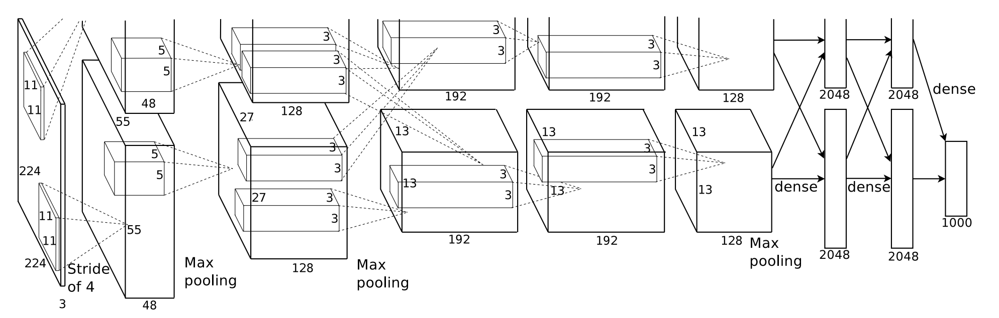

# ml_intro 

[](https://opensource.org/licenses/MIT)

This repo serves as an introduction into some modern ML paradigms and the PyTorch framework. 

## Example Network Architecture
# AlexNet
## Image from paper 


[Link to paper.](
    https://papers.nips.cc/paper/4824-imagenet-classification-with-deep-convolutional-neural-networks.pdf
)


## Architecture of AlexNet. 
The input image is 224x224x3. The output is 1000 classes.
**The First layer** is a Convolutional layer with 96 filters of size 11x11x3 with stride 4 and ReLU activation.
**The Second layer** is a Max pooling layer with size 3x3 and stride 2.
**The Third layer** is a Convolutional layer with 256 filters of size 5x5x48 with stride 1 and ReLU activation.
**The Fourth layer** is a Max pooling layer with size 3x3 and stride 2.
**The Fifth layer** is a Convolutional layer with 384 filters of size 3x3x256 with stride 1 and ReLU activation.
**The Sixth layer** is a Convolutional layer with 384 filters of size 3x3x192 with stride 1 and ReLU activation.
**The Seventh layer** is a Convolutional layer with 256 filters of size 3x3x192 with stride 1 and ReLU activation.
**The Eighth layer** is a Max pooling layer with size 3x3 and stride 2.
**The Ninth layer** is a Fully connected layer with 4096 neurons and ReLU activation.
**The Tenth layer** is a Fully connected layer with 4096 neurons and ReLU activation.
**The Eleventh layer** is a Fully connected layer with 1000 neurons and Softmax activation.


## Installation
**Method 1:** Use a virtual environment to install the required packages.
```bash
python3 -m venv venv
source venv/bin/activate
```
To install the required packages, run the following command:
```bash
pip3 install -r requirements.txt
```

**Method 2:** Use Docker to run the code.
```bash
docker build -t ml_intro .
docker run -it ml_intro
```

## Usage
To run the code, run the following command:
```bash
python3 main.py <config_file>
```
Example:
```bash
python3 main.py config/default.json
```

## License
[MIT](https://choosealicense.com/licenses/mit/)

## Acknowledgements
* [PyTorch](https://pytorch.org/)